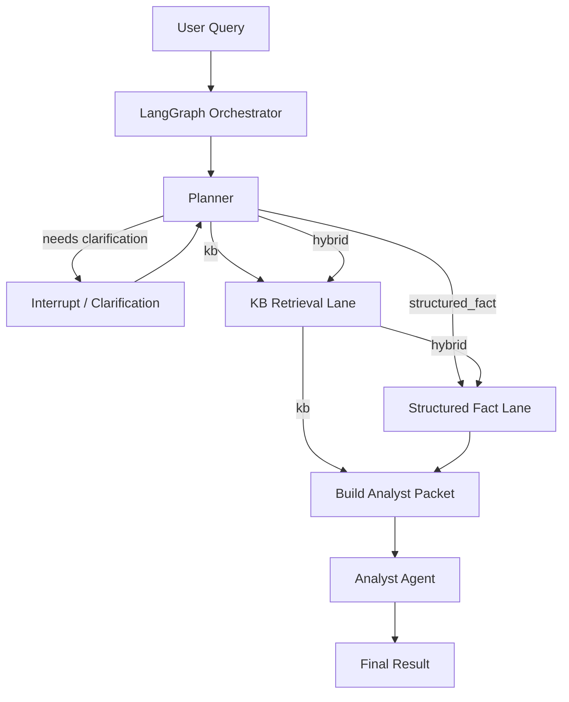
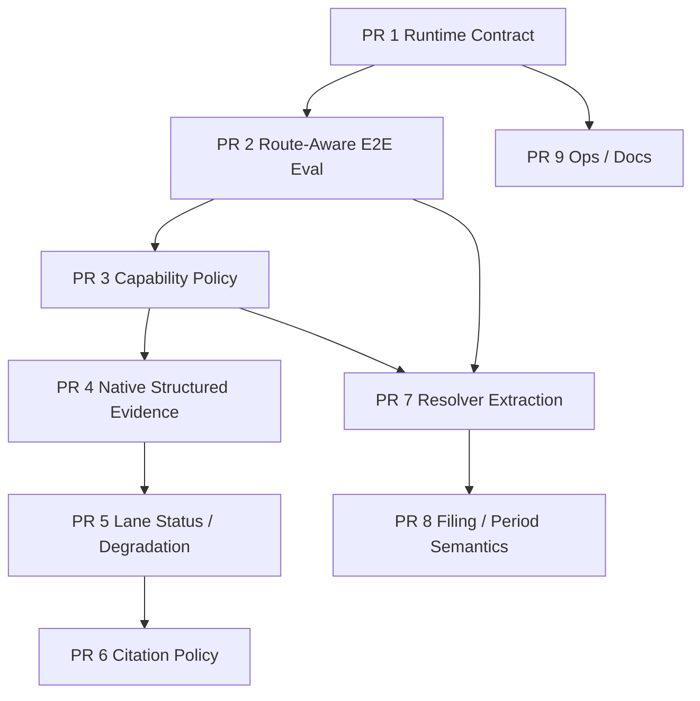

# FinSearch Architecture Alignment & Implementation Plan

**Status:** Active implementation plan
**Audience:** Engineers, new joiners, technical leads, reviewers
**Repository:** `syang620/Finsearch-reboot`
**Primary runtime:** `agents.orchestrator.run_multi_agent_orchestration`
**Purpose:** Align the implemented multi-lane FinSearch runtime with enforceable contracts, route-aware evaluation, typed evidence, and maintainable architecture governance.

## Roadmap status

- PR1 — complete: planner/orchestrator runtime contracts.
- PR2 — complete: canonical route-aware gate passed at `6aae2651518e4495c947e393ed78978b515bd482`.
- PR3 — complete: centralized capability policy post-review verified at `ced41d0718f46bc4e24dd018c830492d3db96ca4`.
- PR4 — next: native structured evidence and SEC provenance.

---

# 1. Executive Summary

FinSearch has evolved beyond the original planner → retrieval → analyst architecture.

The current runtime already supports:

- planner clarification and resume
- `kb`, `structured_fact`, and `hybrid` routes
- bounded KB retrieval with reviewer-guided retry
- deterministic SEC structured-fact execution
- shared analyst packet construction
- grounded analyst synthesis with deterministic arithmetic
- stage timing and structured run output

The main gaps are no longer in the top-level runtime graph. They are in the enforcement and validation layers around it:

1. The planner → orchestrator runtime contract is incomplete.
2. The end-to-end evaluator still assumes the legacy KB-only filing path.
3. Structured-fact routing policy is duplicated across prompt text, hard-coded safeguards, and evaluation fixtures.
4. Structured SEC facts are flattened into synthetic text before reaching the analyst.
5. Hybrid degradation and per-lane outcomes are not first-class runtime concepts.
6. Citation validity is only partially enforced.
7. Metric resolution remains embedded in the orchestrator.
8. Filing amendment and annual-duration semantics are not fully specified.
9. Background maintenance failures are not sufficiently observed.
10. Documentation does not yet have one tracked canonical source of truth.

The recommended implementation order is therefore:

```text
PR 1  Complete planner/orchestrator runtime contracts
  ↓
PR 2  Rebuild route-aware end-to-end evaluation
  ↓
PR 3  Centralize structured-fact capability policy
  ↓
PR 4  Preserve structured evidence and provenance natively
  ↓
PR 5  Introduce per-lane status and degradation semantics
  ↓
PR 6  Harden citation requirements
  ↓
PR 7  Extract structured-fact resolver
  ↓
PR 8  Formalize filing anchoring and period correctness
  ↓
PR 9  Operational cleanup and documentation governance
```

The first two PRs are foundational. They should land before substantial refactoring because they make the runtime boundary enforceable and make the evaluator capable of protecting the intended architecture.

---

# 2. Current-State Architecture

## 2.1 Runtime topology



Current hybrid execution is sequential:

```text
planner
→ KB retrieval
→ structured facts
→ packet construction
→ analyst
```

## 2.2 Major current modules

```text
src/agents/planner/interactive_target_resolution.py
src/agents/orchestrator/agent_orchestrator.py
src/agents/retrieval/query_planner_v2.py
src/agents/retrieval/mcp_client.py
src/agents/analyst/agent.py
src/agents/contracts.py

src/mcp_server/tools/sec_metric.py
src/mcp_server/tools/sec_metric_registry.py
src/mcp_server/tools/sec_retrieval.py
src/mcp_server/tools/financial_evaluator.py

src/evals/agent_eval_contracts.py
src/evals/agent_eval_runner.py
src/agents/planner/evaluation.py
```

---

# 3. Immediate Pre-PR Cleanup

These changes should happen before or alongside the first architecture PRs because they establish an accurate development baseline.

## 3.1 Make `docs/ARCHITECTURE.md` current now

**Recommendation: yes.**

Do not wait until all roadmap work is complete.

The current tracked architecture document still describes the older single-lane runtime. That creates immediate onboarding risk.

Update it now so it describes only the **current implemented runtime**:

- route-aware planner
- `kb`, `structured_fact`, `hybrid`
- clarification interrupts
- KB retrieval workflow
- SEC metric lane
- current synthetic structured-context adapter
- analyst packet and analyst behavior
- current limitations

Do **not** mix long-term roadmap items into the canonical architecture document.

Add a prominent section:

```text
Current implementation boundaries
```

and link to this implementation-plan document for future work.

## 3.2 Track one canonical design/development plan

Add this file to the repository, recommended path:

```text
docs/IMPLEMENTATION_PLAN.md
```

The canonical architecture and implementation plan should have different jobs:

```text
docs/ARCHITECTURE.md
    What the system is now.

docs/IMPLEMENTATION_PLAN.md
    How the system is changing and in what order.
```

## 3.3 Establish a baseline commit and evaluation record

Before PR 1:

1. Record the current commit SHA.
2. Rerun planner P0 after current safety hardening.
3. Save the artifact path.
4. Run focused orchestrator/retrieval/analyst/unit tests.
5. Record known warnings.
6. Do not treat legacy E2E results as architecture validation until PR 2 lands.

Recommended baseline note:

```text
docs/EVALUATION_BASELINES.md
```

Each baseline should include:

- commit SHA
- model
- dataset version
- command
- pass/fail result
- artifact path
- known limitations

## 3.4 Add ADR directory before architectural behavior changes

Create:

```text
docs/adr/
```

Use short ADRs for decisions that should not live only in code comments or prompts.

Initial ADR backlog:

```text
001-routing-and-lane-ownership.md
002-structured-fact-capability-policy.md
003-degradation-semantics.md
004-citation-policy.md
005-filing-anchor-and-amendments.md
```

These can be added incrementally with the PR that introduces each decision.

## 3.5 Fix detached background-task observation early

This is small and low-risk enough to do before larger PRs, or bundle into PR 1.

Current stale-checkpoint pruning runs as a detached task. A callback should:

- remove the task from `_BACKGROUND_TASKS`
- consume `task.exception()` or `task.result()`
- ignore normal cancellation
- log unexpected maintenance errors

The cleanup task should remain non-fatal to user requests.

---

# 4. PR 1 — Complete the Planner → Orchestrator Runtime Contract

## 4.1 Goal

Define and enforce one authoritative typed contract for the final planner output consumed by the orchestrator.

## 4.2 Problem

The current shared `PlannerOutput` does not represent all fields that actually drive orchestration.

Runtime fields include concepts such as:

- status
- route
- structured-fact requests
- task class
- targets
- retrieval plan
- clarification state
- open issues

Some are typed privately inside the planner, while the orchestrator consumes normalized dictionaries.

This allows contract validation to succeed without validating the complete execution-driving payload.

## 4.3 Scope

Introduce shared models in `src/agents/contracts.py` or a dedicated contracts module:

```python
PlannerTaskClass
PlannerTarget
RetrievalPlanJob
RetrievalPlan
PlannerClarification
PlannerRuntimeOutput
```

Suggested `PlannerRuntimeOutput`:

```python
class PlannerRuntimeOutput(BaseModel):
    model_config = ConfigDict(extra="forbid")

    status: Literal["completed", "needs_clarification", "error"]
    retrieval_needed: bool
    intent: PlannerIntent
    route: PlannerRoute

    structured_fact_requests: list[StructuredFactRequest]

    metadata: FilingMetadata
    analysis_task: AnalysisTask

    task_class: PlannerTaskClass
    targets: list[PlannerTarget]
    retrieval_plan: RetrievalPlan | None

    open_issues: list[OpenIssue]

    original_user_query: str
    effective_user_query: str
    clarification_history: list[dict[str, str]]
    clarification_request: PlannerClarification | None
```

Exact field placement may be adjusted after reviewing which fields are execution contract versus trace metadata.

## 4.4 Design rule

Keep two separate concepts:

### Raw planner LLM schema

Private to planner implementation.

Purpose:

- constrain model output
- parse LLM response
- support planner-specific normalization

### Planner runtime contract

Shared across planner and orchestrator.

Purpose:

- validate the final planner → orchestrator handoff

Do not force these to be the same class if they serve different stages.

## 4.5 Implementation steps

1. Inventory every field read by `agent_orchestrator.py` from `plan_obj`.
2. Inventory fields emitted by planner packaging.
3. Define the shared runtime models.
4. Add `extra="forbid"` at the cross-component boundary.
5. Convert planner packaging to return a validated runtime object or validated serialized form.
6. Validate the planner result exactly once at the orchestrator boundary.
7. Replace ad-hoc coercion where practical.
8. Keep graph state as `TypedDict` initially; do not turn PR 1 into a full state-system rewrite.

## 4.6 Tests

Add:

```text
tests/agents/contracts/test_planner_runtime_contract.py
```

Cases:

- valid KB plan
- valid structured-fact plan
- valid hybrid plan
- clarification state
- planner error state
- missing target field
- invalid target ID
- invalid retrieval-plan target reference
- unknown extra field
- missing route
- structured route without requests
- malformed clarification payload

Add integration assertion that real planner output validates against the runtime contract.

## 4.7 Acceptance criteria

- All orchestrator-driving planner fields are represented in one shared model.
- Extra execution-driving fields cannot be silently discarded.
- Planner live outputs validate against the shared runtime contract.
- Existing planner behavior tests continue passing.
- Existing orchestrator route tests continue passing.
- No redesign of retrieval or structured execution occurs in this PR.

## 4.8 Risks

- Accidentally including trace/debug fields in the normative contract.
- Making the contract too tightly coupled to one planner implementation.
- Expanding scope into full graph-state typing.

Mitigation:

Keep the contract focused on fields required for downstream execution.

---

# 5. PR 2 — Rebuild Route-Aware End-to-End Evaluation

## 5.1 Goal

Make the E2E evaluator capable of validating the implemented multi-lane architecture.

## 5.2 Problem

The current evaluator assumes:

```text
filing_fact / filing_calc
→ retrieval_required
→ analyst
```

This incorrectly rejects valid structured-fact routes and cannot evaluate hybrid degradation or structured evidence.

## 5.3 Extend evaluation contracts

Update:

```text
src/evals/agent_eval_contracts.py
```

Suggested expected fields:

```python
class AgentExpected(BaseModel):
    intent: PlannerIntentStr | None = None
    route: Literal["kb", "structured_fact", "hybrid"] | None = None

    ticker: str | None = None
    fiscal_year: int | None = None
    form_type: str | None = None

    expect_kb_lane: bool | None = None
    expect_structured_fact_lane: bool | None = None

    expected_structured_metric: str | None = None
    expected_structured_status: str | None = None

    expected_run_status: Literal[
        "completed",
        "degraded",
        "failed",
        "interrupted",
    ] | None = None

    expected_failure_stage: str | None = None
    expected_analyst_status: str | None = None

    must_use_financial_evaluator: bool | None = None
    expected_metric: str | None = None
    expected_min_citations: int = 1

    allow_degraded: bool = False
```

## 5.4 Remove legacy invalid invariant

Delete:

```text
filing_fact or filing_calc
AND retrieval_needed == false
=> RETRIEVAL_ROUTING_INVALID
```

Replace it with route-aware checks.

### KB

Expected:

- KB retrieval where appropriate
- no required structured lane

### Structured fact

Expected:

- structured execution
- no KB requirement

### Hybrid

Expected:

- both lanes requested
- lane-level partial failure allowed only when explicitly configured

## 5.5 Add lane-level evaluation

Capture:

```text
route
top-level status
failure_stage

kb requested
kb attempted
kb status

structured requested
structured attempted
structured statuses
resolved metric IDs

analyst status
analyst citations
```

## 5.6 Evaluate actual analyst evidence

Do not reconstruct semantic contexts only from retrieval `top_tables`.

Add an evaluation/debug trace exposing the final normalized analyst evidence.

Options:

### Preferred

Add evaluation-only serialization:

```python
serialize_analyst_packet_for_eval(packet)
```

and expose it in orchestration output only when:

```text
include_evidence_trace=True
```

### Alternative

Add context trace to debug output.

RAGAS and future claim-grounding metrics should evaluate the exact evidence supplied to the analyst.

## 5.7 New E2E dataset

Create a route-aware v1 dataset:

```text
data/evals/agents/v1/agent_eval_routing_v1.jsonl
```

Recommended minimum cases:

### Structured fact

- revenue
- net income
- operating cash flow
- total debt

### KB

- business growth drivers
- risk factors
- demand commentary

### Hybrid

- revenue + drivers
- cash flow + explanation
- debt + financing discussion

### Structured degradation

- unsupported metric
- not found
- ambiguous metric

### Hybrid degradation

- KB fails / structured succeeds
- structured fails / KB succeeds
- one lane partial

### Planner control flow

- clarification required
- invalid/missing target metadata

### Analyst behavior

- calculator-required task
- insufficient-data task
- citation-required task

## 5.8 Metrics

Deterministic:

```text
route_accuracy
planner_contract_validity
metadata_accuracy
kb_lane_accuracy
structured_lane_accuracy
structured_metric_resolution_accuracy
structured_status_accuracy
analyst_status_accuracy
citation_minimum_accuracy
failure_stage_accuracy
degradation_accuracy
```

Operational:

```text
planner_ms
retrieval_ms
structured_fact_ms
analyst_ms
total_ms
```

Semantic:

```text
answer_relevancy
faithfulness
context_precision
context_recall
```

Do not use semantic metrics as a substitute for deterministic architectural checks.

## 5.9 Tests

Add unit tests around evaluation itself:

- structured route is not marked retrieval-invalid
- hybrid expected lanes are checked
- structured evidence enters semantic context extraction
- degradation is handled distinctly from failure
- route mismatch is caught
- nested structured status mismatch is caught

## 5.10 Acceptance criteria

- A correct pure structured-fact run can pass E2E evaluation.
- A correct hybrid run can pass.
- A deliberately broken structured lane fails the correct check.
- Hybrid partial degradation can be represented.
- RAGAS contexts contain the actual analyst evidence.
- Legacy v0 evaluation remains available but is clearly labeled legacy.

---

# 6. PR 3 — Centralize Structured-Fact Capability Policy

## 6.1 Goal

Create one deterministic policy layer defining what the structured lane is allowed to handle.

## 6.2 Problem

Policy is currently duplicated across:

- planner prompt
- unsupported-pattern safeguards
- registry capabilities
- evaluation fixtures

This can drift.

## 6.3 Create

```text
src/structured_facts/
    __init__.py
    capabilities.py
```

Suggested concepts:

```python
StructuredFactCapability
StructuredFactCapabilityPolicy
StructuredFactQuestionClass
```

Policy should distinguish:

```text
supported_direct_metric
unsupported_derived_metric
unsupported_ratio
unsupported_per_share
unsupported_comparison
ambiguous
unknown
```

## 6.4 Important distinction

The **metric registry** answers:

> What metric IDs can the SEC metric tool execute?

The **capability policy** answers:

> What user question classes may route to the structured lane?

These should not be conflated.

Example:

`total_debt` may be a derived registry metric but still be supported by the structured lane because its computation is deterministic and explicitly registered.

## 6.5 Use policy in

- deterministic planner safety guard
- planner prompt generation or prompt appendix
- structured-lane validation
- developer diagnostics

## 6.6 Evaluation independence

Do not auto-generate every behavior test from the capability policy.

Keep adversarial test cases independently maintained so tests can catch incorrect policy configuration.

## 6.7 Acceptance criteria

- Unsupported classes have one deterministic policy source.
- Each proposed structured request is classified independently; mixed supported and
  rejected proposals retain the supported requests and use a hybrid route for the
  rejected portions.
- Materially ambiguous proposals request clarification before execution.
- Classification precedence is unsupported semantics, exact supported phrase,
  ambiguous generic metric, supported alias, then unknown.
- The capability policy decides whether execution is permitted; it does not own
  filing-specific resolution or SEC fact execution semantics.
- ROE/ROA/FCF yield/EV-EBITDA/broad summaries cannot slip through due to prompt drift.
- Planner behavior regression remains green.
- Adding a new supported structured capability has an explicit policy change.
- An independently frozen adversarial dataset records before/after structured-route
  precision, supported-query recall, unsupported-query rejection, ambiguity
  clarification accuracy, and false structured-routing rate.

---

# 7. PR 4 — Native Structured Evidence and SEC Provenance

## 7.1 Goal

Stop flattening structured SEC facts into ordinary text before they reach the analyst.

## 7.2 Contract changes

Extend:

```python
class ContextItemKind(str, Enum):
    TABLE = "table"
    TEXT = "text"
    STRUCTURED_FACT = "structured_fact"
```

Add typed payload model:

```python
class StructuredFactEvidence(BaseModel):
    metric_id: str | None
    metric_label: str | None
    status: str
    value: float | None
    unit: str | None

    ticker: str | None
    fiscal_year: int | None
    form_type: FormType | None

    accession_number: str | None
    report_date: str | None
    filed_date: str | None
    source_url: str | None

    components: list[dict]
    missing_component_groups: list[str]
```

Extend `SourceRef`:

```text
source_url
report_date
```

## 7.3 Packet behavior

Only successful or meaningfully usable structured evidence should become evidence context.

For:

```text
unsupported_metric
unresolved
ambiguous
missing_inputs
hard error
```

prefer:

```text
open_issues
```

over pretending the failure message is evidentiary context.

`partial` may become context only when the analyst prompt explicitly understands that it is incomplete.

## 7.4 Analyst prompt rendering

Render structured evidence separately:

```text
[ctx_3] STRUCTURED FACT
metric: Revenue
value: 391035000000
unit: USD
filing: AAPL FY2024 10-K
source: ...
```

Do not force the analyst to reverse-parse synthetic prose.

## 7.5 Citation result

Final citations should preserve:

```text
context_id
ticker
fiscal_year
form_type
accession_no
report_date
source_url
```

## 7.6 Acceptance criteria

- Structured values remain numeric.
- SEC source URLs survive through final citations.
- Failed structured requests do not improve context quality merely by existing.
- Analyst behavior remains backward compatible for KB evidence.
- Hybrid evaluation can identify structured versus narrative evidence.

---

# 8. PR 5 — Per-Lane Status and Degradation Semantics

## 8.1 Goal

Represent sibling-lane outcomes explicitly.

## 8.2 Top-level status

Proposed:

```text
completed
degraded
failed
interrupted
```

## 8.3 Lane state

Add normalized lane summaries:

```json
{
  "lanes": {
    "kb": {
      "requested": true,
      "attempted": true,
      "status": "ok",
      "issues": []
    },
    "structured_fact": {
      "requested": true,
      "attempted": true,
      "status": "partial",
      "issues": []
    }
  }
}
```

Candidate lane statuses:

```text
not_requested
ok
partial
failed
ambiguous
unsupported
skipped
```

## 8.4 Failure stage

Retain `failure_stage` only for fatal run termination:

```text
planner
retrieval
structured_fact
analyst
none
```

Do not use one scalar stage to encode all partial degradation.

## 8.5 Example

Hybrid query:

```text
KB retrieval failed.
Structured revenue succeeded.
Analyst returned the numeric answer and explicitly stated that filing explanation was unavailable.
```

Expected:

```text
status = degraded
failure_stage = none
kb.status = failed
structured_fact.status = ok
analyst.status = ok
```

## 8.6 Acceptance criteria

- Partial hybrid outcomes are machine-readable.
- Fatal structured-fact failure can be identified as a stage where appropriate.
- E2E evaluator checks lane outcomes.
- User-facing answer never silently hides degradation.

---

# 9. PR 6 — Citation Policy and Grounding Hardening

## 9.1 Goal

Strengthen runtime citation validity while keeping claim-level faithfulness as an evaluation concern.

## 9.2 Runtime invariants

For filing-based answers with:

```text
status = ok
```

require at least one valid context citation when evidence is available.

Unknown context IDs:

1. trigger an analyst retry where retry budget remains;
2. otherwise remove invalid citations;
3. if no valid evidence remains, degrade the final status rather than returning unqualified `ok`.

## 9.3 Structured citation requirements

Structured numerical claims should cite the structured-fact context that produced them.

Narrative attribution claims should cite KB narrative evidence.

Hybrid answers should not use a structured metric citation as evidence for a management-explanation claim.

## 9.4 Evaluation

Add claim/evidence evaluation for:

- numeric consistency
- citation existence
- citation source completeness
- attribution support
- answer-citation mismatch

Claim-level faithfulness may use a judge model as secondary evaluation.

## 9.5 Acceptance criteria

- Successful filing-grounded answers have valid citations.
- Invalid context IDs cannot silently disappear while answer remains fully successful.
- Structured source URL appears in structured citations.
- Hybrid citation types can be evaluated independently.

---

# 10. PR 7 — Extract Structured-Fact Resolver

## 10.1 Goal

Remove metric semantics from the orchestrator.

## 10.2 Create

```text
src/structured_facts/
    resolver.py
    models.py
```

Move:

- lookup normalization
- alias definitions
- registry-term generation
- exact matching
- phrase matching
- ambiguity handling
- target matching
- ticker/year resolution

## 10.3 Proposed API

```python
resolve_structured_fact_request(
    request: StructuredFactRequest,
    targets: list[PlannerTarget],
    metadata: FilingMetadata,
) -> StructuredFactResolution
```

Resolution result:

```python
class StructuredFactResolution(BaseModel):
    status: Literal[
        "resolved",
        "ambiguous",
        "unresolved",
        "missing_inputs",
    ]

    metric_id: str | None
    ticker: str | None
    fiscal_year: int | None
    reason: str | None
```

## 10.4 Acceptance criteria

- Orchestrator contains no alias map.
- Resolver preserves current behavior.
- `cash` remains ambiguous.
- broad aliases remain rejected.
- resolver unit tests cover all registered metrics and critical ambiguity cases.

---

# 11. PR 8 — Filing Anchor, Amendments, and Annual Period Semantics

## 11.1 Goal

Make SEC fact selection rules explicit and financially correct.

## 11.2 ADR

Create:

```text
docs/adr/005-filing-anchor-and-amendments.md
```

Specify:

- original 10-K versus 10-K/A precedence
- when amendments supersede facts
- report-date versus accession matching
- duration-fact annuality requirements
- 52-week / 53-week fiscal-year handling
- duplicate/conflicting fact handling

## 11.3 Data-model change

Preserve fact `start` dates for duration metrics.

Validate that duration facts correspond to the intended annual period.

Avoid selecting YTD or quarter-only facts solely because end date matches.

## 11.4 Tests

- original 10-K only
- 10-K plus 10-K/A
- amendment changes relevant fact
- same end date with different start dates
- 52-week fiscal year
- 53-week fiscal year
- duplicate conflicting values
- annual duration versus YTD duration

## 11.5 Acceptance criteria

- Annual duration selection is explicitly tested.
- Amendment behavior is documented and deterministic.
- SEC metric result trace explains selection reason.

---

# 12. PR 9 — Operational Cleanup and Documentation Governance

## 12.1 Background tasks

Implement a task completion callback:

```python
def _observe_background_task(task):
    _BACKGROUND_TASKS.discard(task)
    if task.cancelled():
        return
    try:
        task.result()
    except Exception:
        logger.exception("Background orchestrator maintenance task failed")
```

## 12.2 Logging

Introduce consistent structured logs for:

```text
run_id
route
planner status
lane statuses
failure stage
degradation
timings
provider errors
MCP errors
```

## 12.3 Canonical documentation structure

Recommended:

```text
docs/
    ARCHITECTURE.md
    IMPLEMENTATION_PLAN.md
    ROADMAP.md
    RUNBOOK.md
    EVALUATION.md
    EVALUATION_BASELINES.md
    adr/
```

### ARCHITECTURE.md

Current system only.

### IMPLEMENTATION_PLAN.md

Ordered development plan and acceptance criteria.

### ROADMAP.md

Longer-term capabilities not committed to a current PR.

### RUNBOOK.md

Environment setup, operational procedures, troubleshooting.

### EVALUATION.md

Evaluation architecture and release gates.

### EVALUATION_BASELINES.md

Measured results tied to:

- commit
- model
- dataset
- artifact

## 12.4 Remove stale result claims from architecture

Do not put mutable claims such as:

```text
Planner currently scores 24/25.
```

in the canonical architecture doc.

Instead put:

```text
Planner P0 routing must satisfy the defined release gate.
See EVALUATION_BASELINES.md for the current measured baseline.
```

## 12.5 Acceptance criteria

- One tracked canonical architecture source exists.
- Mutable benchmark results live separately.
- Background maintenance errors are observed.
- New joiners can identify current architecture versus roadmap within minutes.

---

# 13. Cross-PR Testing Requirements

Every architecture PR must run:

## Deterministic unit tests

```text
planner normalization
contract validation
resolver behavior
graph routing
retrieval dispatch
analyst parsing
SEC metric tool
```

## Behavior tests

As applicable:

```text
planner route suite
retrieval behavior suite
structured metric fixtures
hybrid degradation tests
```

## End-to-end tests

After PR 2:

Run the route-aware E2E suite for every architecture-affecting PR.

## Raw artifacts

Live-model evaluations must save:

```text
query
expected behavior
actual route
planner output
lane results
analyst result
timings
errors
```

Do not reduce live-model evaluation to only an aggregate score.

---

# 14. Architectural Invariants to Protect

The following should be treated as release-blocking invariants.

## Planner

- Planner does not emit internal `metric_id`.
- Resolved deterministic ticker/year are not overwritten.
- Unsupported structured question classes do not reach structured execution.
- Clarification is explicit.

## Orchestrator

- Orchestrator owns route execution.
- KB and structured lanes remain independently degradable.
- Hybrid does not silently hide lane failure.
- Planner/runtime contract is validated.

## Retrieval

- Retrieval agent does not answer.
- Target metadata remains deterministic.
- Retry remains bounded.

## Structured facts

- Metric execution is registry-backed.
- Unknown metric is a structured status.
- Arithmetic is deterministic.
- Provenance is retained.

## Analyst

- Uses supplied context only.
- Calculation-required tasks use the evaluator.
- Missing evidence fails closed.
- Successful filing-based answers use valid evidence.

## Evaluation

- Route-aware E2E evaluation is authoritative for release readiness.
- Component metrics remain separately visible.
- Raw traces are retained for behavioral failures.

---

# 15. Recommended PR Dependency Graph



PRs 4–6 may be adjusted after PR 2 provides better E2E measurements.

PR 7 can technically start after PR 2 and PR 3, but it should not precede them.

---

# 16. Definition of Done for Each PR

An architecture PR is not complete until:

- implementation is finished
- shared contracts are updated
- deterministic tests pass
- relevant behavior evaluation passes
- route-aware E2E evaluation passes where applicable
- degradation/failure cases are tested
- raw evaluation artifact is stored for model behavior changes
- documentation is updated
- migration/compatibility behavior is documented
- rollback path is clear

---

# 17. Immediate Next Actions

Before PR 1 begins:

- [ ] Update tracked `docs/ARCHITECTURE.md` to reflect the current multi-lane runtime.
- [x] Track this document as `docs/IMPLEMENTATION_PLAN.md`.
- [ ] Create `docs/adr/`.
- [ ] Record current `master` commit in `docs/EVALUATION_BASELINES.md`.
- [ ] Rerun planner P0 against current master and record the result.
- [ ] Record existing targeted-test baseline.
- [ ] Fix or explicitly track the unobserved checkpoint-pruning task warning.
- [ ] Label the existing E2E evaluator/documentation as legacy until PR 2.
- [ ] Do not begin resolver extraction before PR 1 and PR 2 are in place.

---

# 18. Longer-Term Work Outside This Plan

The following remain valuable but should not distract from architectural alignment:

- quarterly structured facts
- multi-period structured calculations
- structured multi-company comparison
- broader metric registry
- native hybrid claim typing
- parallel KB/structured execution
- durable event-driven filing monitoring
- watchlist/portfolio workflows
- cache and rate-limit optimization
- production observability dashboards

These belong in `docs/ROADMAP.md`, not in the immediate implementation sequence.
